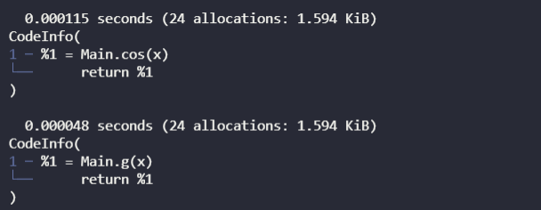

# Julia_tips
Juliaを使っていて学んだTipsを書き溜めておきます.

## 基本演算
## 割り算の結果を整数で返すか実数で返すか

```julia
div(4,2) ## 整数2が返る
4/2 ## 実数2.0が返る
```

## 関数のあれそれ
## returnするかしないかによる速度の違い
以下の2つのコードの違いはなんだろうって思った.
```julia
function f(x)
    cos(x)
end

function g(x)
    return g(x)    
end
```
それぞれを実行したときの動作と実行時間を調べてみると
```julia
@time @code_lowered f(4)
@time @code_lowered g(4)
```


こんな感じで, 動作は同じだけど, ちゃんとreturnしたほうが早いみたい

## 配列の操作
### ベクトルと行列
```julia
  a=[1,2,3] #縦ベクトル
  a=[1 2 3] #1×3の行列
```


### 配列の各要素に関数や演算を適用したい場合.
- 関数の場合

例としてA=[1,2,3]の配列の各要素に絶対値を返す関数abs()を適用したいとき, 書き方としては以下の2通りがある.
```julia
    broadcast(abs,A) # broadcastを用いた演算
    abs.(A) # .演算を用いた場合
```
ここで注意すべきことは, .演算を用いるときに対象の配列に括弧()をつけるのを忘れないこと. ()をつけることで**配列内の要素**に対して関数を適用してくれ. という意味になる. なお, broadcastを使った場合にも括弧()をつけても問題ない.

- 演算の場合
  
例として配列Aの各要素から-1をする演算をしたいとする. このときの書き方としては以下の2通りがある.
  ```julia
    broadcast(-,A,1) # broadcastを用いた場合
    (A).-1 # .演算を用いた場合
  ```
これを見るとわかるように, broadcast関数は`broadcast(<演算>,<演算の左側>,<演算の右側>)`というように書くことができる. なお, A.(-1)のようにすると意味が通らなくなるので注意.

### 配列(ベクトル or Array)の要素を変数に割り振る
配列(ベクトル)a=[1.0,-1.0]があったとして, それを$x$成分, $y$成分というように分けたい場合

```julia
  a=[1.0,-1.0]
  x,y=a
```
または
```julia
  a=[1.0 -1.0]
  x,y=a
```
とすれば割り振ってくれる.

### 2つ以上の配列を結合する.
- 縦に結合する場合

```julia
  a=[1,2,3]
  b=[2,3,4]
  vcat(a,b)
```
結果は
```
6-element Vector{Int64}:
 1
 2
 3
 2
 3
 4
```
が返ってくる.

- 横に結合する場合
```julia
  a=[1,2,3]
  b=[2,3,4]
  hcat(a,b)
```
結果は
```
3×2 Matrix{Int64}:
 1  2
 2  3
 3  4
```
が返ってくる.

### 初期化における型指定
```julia
B=zeros(ComplexF64,3,3)
B = Array{ComplexF64}(undef,3,3)

```
こんな感じにすれば良い.

## 線形代数
### ベクトルを横ベクトルにする.
Juliaではa=[1,2,3]というように置いたとき, ベクトルとして認識され,
$$
a=
\begin{pmatrix}
  1\\
  2\\
  3
\end{pmatrix}
$$
のように縦ベクトルで出力される. しかし, 結果を出力する際など横ベクトルで書いてくれた方が嬉しい場合がある. そういったときにはベクトルを新しいベクトルの第一成分にまとめて収めるという考えから,
```julia
  [a]
```
とすれば横ベクトルで出力される. なお, 形式は`Vector{Vector}`となっている.

### 


### 連立方程式の解法
$A\bm{x}=\bm{b}$をときたい場合にはLinearAlgebraパッケージを用いて以下のように書く.
```julia
  using LinerAlgebra
  x = A \ b
```